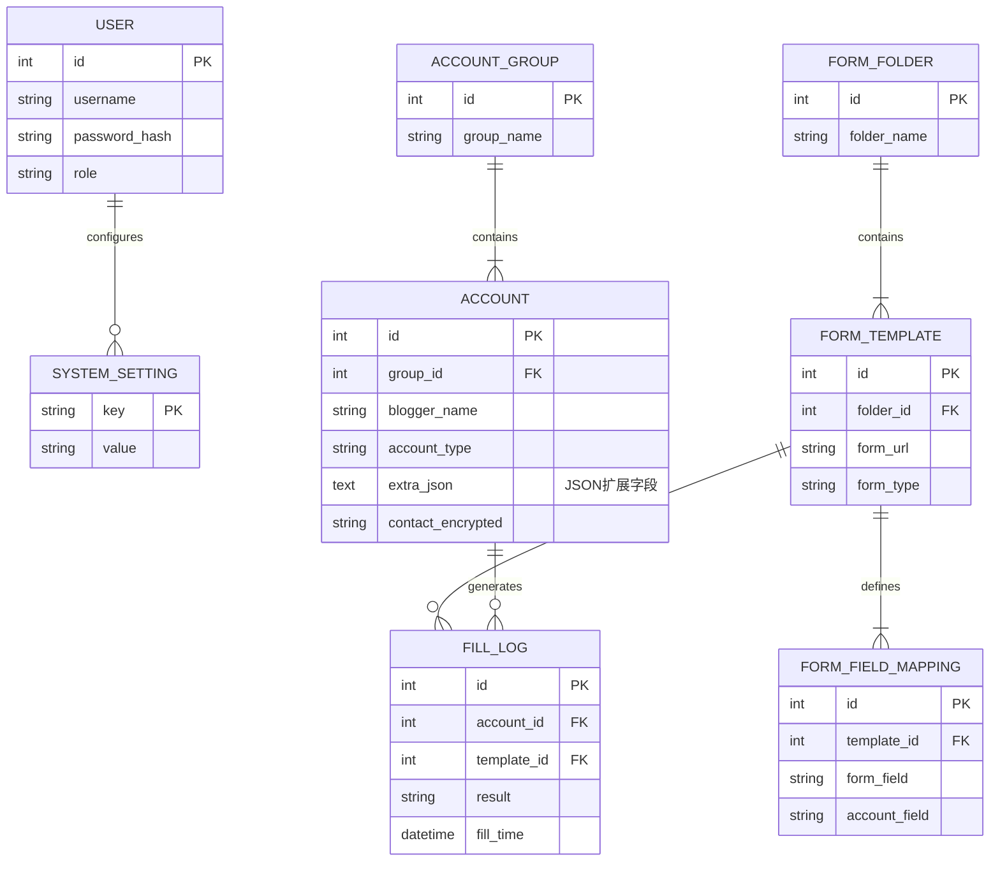
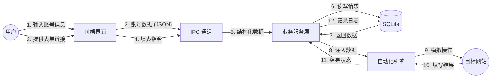
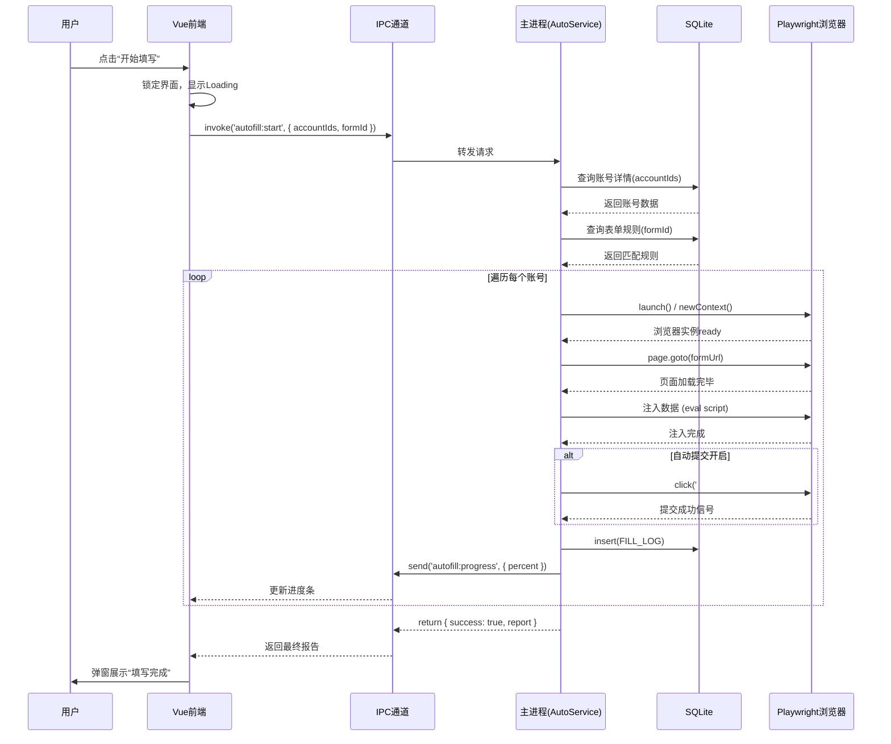

# Electron 后端迁移与生产计划文档 (V1.0)

## 1. 项目背景与目标

本项目 `Project_Auto_Fill_Forms` 目前已完成基于 Vue 3 的纯前端版本开发。为了实现核心的**自动化表单填写**（突破浏览器沙箱限制）、**本地数据持久化**（SQLite 数据库）以及**系统级操作**（文件读写），需要将项目迁移至 **Electron** 架构。

本计划旨在指导从“纯前端 Web 应用”向“Electron 桌面应用”的平滑迁移，构建稳定、可扩展的后端架构。

## 2. 系统架构设计

### 2.1 总体架构图

采用经典的 **Electron 双进程架构**，前端 Vue 作为渲染进程，Node.js 作为主进程处理业务逻辑和底层交互。

```mermaid
graph TD
    subgraph "渲染进程 (Renderer Process)"
        UI[Vue 3 前端界面]
        Store[Pinia 状态管理]
        Router[Vue Router]
        IPC_Client[IPC 渲染端 (preload.js)]
    end

    subgraph "主进程 (Main Process)"
        IPC_Server[IPC 主进程监听]
        App_Core[应用核心控制器]
        
        subgraph "业务服务层 (Services)"
            AccountService[账号服务]
            FormService[表单服务]
            AutoFillService[自动填表引擎]
            DataService[备份/日志服务]
        end
        
        subgraph "基础设施层 (Infrastructure)"
            DB[SQLite 数据库]
            FS[文件系统 (fs-extra)]
            Browser_Engine[Playwright/Puppeteer]
        end
    end

    UI --> Store
    Store -- Action调用 --> IPC_Client
    IPC_Client -- IPC通信 (invoke/handle) --> IPC_Server
    IPC_Server --> App_Core
    App_Core --> AccountService
    App_Core --> FormService
    App_Core --> AutoFillService
    App_Core --> DataService
    
    AccountService --> DB
    FormService --> DB
    DataService --> DB & FS
    AutoFillService --> Browser_Engine
```

### 2.2 核心模块划分

| 模块名称 | 当前状态 (前端) | 目标状态 (Electron) | 迁移/开发策略 |
| :--- | :--- | :--- | :--- |
| **UI 界面** | 已完成 (Vue Views) | **复用** (Renderer) | 几乎无需修改，仅需替换数据源 API 调用。 |
| **状态管理** | 已完成 (Pinia + LocalStorage) | **改造** (Pinia + IPC) | 移除 LocalStorage，Action 改为调用 `window.electronAPI`。 |
| **账号管理** | 前端逻辑 | **后端化** (SQLite) | 主进程实现 CRUD，数据存入 SQLite。 |
| **表单管理** | 前端逻辑 | **后端化** (SQLite) | 主进程实现表单/文件夹管理。 |
| **自动填表** | Mock/Iframe 模拟 | **全新开发** (Playwright) | 核心功能，引入 Playwright 控制隐形/显形浏览器操作。 |
| **数据备份** | 前端 JSON 导出 | **后端化** (FS 流) | 利用 Node.js `fs` 模块实现高效读写。 |
| **系统设置** | LocalStorage | **配置文件** (electron-store) | 使用 `electron-store` 存储轻量配置（主题、窗口状态）。 |

---

## 3. 组件间调用关系与 IPC 设计

为了保证安全性，渲染进程不直接访问 Node.js API，而是通过 `ContextBridge` 暴露安全方法。

### 3.1 IPC 通信模式
*   **模式**：`Renderer` -> `invoke` -> `Main` -> `handle` -> `return result`
*   **命名规范**：`模块:动作` (e.g., `account:create`, `form:fill`)

### 3.2 调用流程示例 (以“获取账号列表”为例)

1.  **Vue Component**: `Account.vue` 调用 `accountStore.fetchAccounts()`
2.  **Pinia Store**: `fetchAccounts` 调用 `window.electron.account.getAll()`
3.  **Preload Script**:
    ```javascript
    // preload.js
    contextBridge.exposeInMainWorld('electron', {
      account: {
        getAll: () => ipcRenderer.invoke('account:getAll')
      }
    })
    ```
4.  **Main Process**:
    ```javascript
    // main/services/AccountService.js
    ipcMain.handle('account:getAll', async () => {
      return await db.select('*').from('accounts');
    });
    ```

---

## 4. 详细生产实施路径 (Roadmap)

### 阶段一：Electron 环境搭建与基础迁移 (预计 3 天)
**目标**：让现有的 Vue 项目在 Electron 窗口中跑起来，并打通 IPC 通信。

*   [ ] **初始化 Electron**：安装 `electron`, `electron-builder`。
*   [ ] **配置 Vite**：配置 `vite-plugin-electron` 实现 Vue + Electron 热重载开发。
*   [ ] **主进程架构**：创建 `electron/main.js`, `electron/preload.js`。
*   [ ] **IPC 通信测试**：实现一个简单的 `app:getVersion` 接口，前端展示版本号，验证通信通畅。
*   [ ] **Lint/Test 环境**：配置 ESLint (支持 Node 环境) 和 Vitest (测试主进程逻辑)。

### 阶段二：数据持久化层 (SQLite) 实现 (预计 5 天)
**目标**：废弃 LocalStorage，使用 SQLite 存储核心业务数据。

*   [ ] **数据库选型**：集成 `better-sqlite3` 或 `sqlite3`，配置 `knex.js` 或 `typeorm` (推荐 Knex 构建查询)。
*   [ ] **数据库设计**：
    *   `accounts` 表：存储账号基础信息、JSON 扩展字段。
    *   `forms` 表：存储表单链接、匹配规则。
    *   `logs` 表：存储操作日志。
*   [ ] **服务层开发**：
    *   `AccountService`：实现 CRUD。
    *   `FormService`：实现 CRUD。
*   [ ] **前端对接**：改造 Pinia Store，将 `localStorage` 操作替换为 IPC 调用。
*   [ ] **测试**：编写 Unit Test 测试 Service 层的 CRUD 逻辑。

### 阶段三：核心业务 - 自动化填表引擎 (预计 7-10 天)
**目标**：实现真正的自动填表功能。

*   [ ] **引擎集成**：引入 **Playwright** (推荐，比 Puppeteer 更稳定，支持多浏览器)。
*   [ ] **填表逻辑开发** (`AutoFillService`)：
    *   启动浏览器实例 (Headless 或 Headed 模式)。
    *   页面导航与等待 (`page.goto`, `page.waitForSelector`)。
    *   字段识别与注入 (基于 CSS Selector/XPath)。
    *   异常捕获与截图 (错误处理)。
*   [ ] **任务队列**：实现简单的队列机制，支持“批量填表”时的串行执行。
*   [ ] **前端交互**：实时反馈填表进度（通过 `WebContents.send` 推送进度事件）。

### 阶段四：系统功能与优化 (预计 3 天)
**目标**：完善辅助功能。

*   [ ] **配置存储**：集成 `electron-store` 存储用户偏好（主题、窗口大小）。
*   [ ] **日志系统**：集成 `electron-log`，将运行日志写入本地文件。
*   [ ] **安全性检查**：配置 CSP，禁用 Node Integration (渲染进程)，确保安全。

### 阶段五：打包与发布 (预计 2 天)
**目标**：生成可安装的 .exe/.dmg 文件。

*   [ ] **图标与元数据**：配置应用图标、AppId。
*   [ ] **构建配置**：配置 `electron-builder.yml`。
*   [ ] **安装包测试**：在干净的 Windows 环境中测试安装、运行、卸载。

---

## 5. 测试策略

每个功能开发完成后，必须执行以下测试：

1.  **单元测试 (Unit Test)**：
    *   **对象**：Main Process 中的 Services (AccountService, FormService)。
    *   **工具**：Vitest。
    *   **要求**：Mock 数据库调用，测试业务逻辑覆盖率 > 80%。

2.  **集成测试 (Integration Test)**：
    *   **对象**：IPC 接口。
    *   **方法**：通过脚本模拟 Renderer 调用 `invoke`，验证数据库是否正确写入。

3.  **端到端测试 (E2E Test)**：
    *   **对象**：整个应用流程。
    *   **工具**：Playwright Electron。
    *   **场景**：启动应用 -> 添加账号 -> 点击填表 -> 验证结果。

---

## 6. 业务扩展性规划

在架构设计时，预留以下扩展接口：

1.  **云端同步 (Cloud Sync)**：
    *   **设计**：Service 层增加 `SyncService`，数据层预留 `sync_status` 和 `remote_id` 字段。
    *   **扩展**：未来对接 REST API，将 SQLite 数据同步至云端 MySQL。

2.  **插件系统 (Plugin System)**：
    *   **设计**：将“填表逻辑”抽象为策略模式。
    *   **扩展**：针对不同平台（腾讯文档 vs 问卷星），加载不同的填表策略脚本 (`Strategy Pattern`)。

3.  **多用户/团队协作**：
    *   **设计**：数据库预留 `user_id` 字段。
    *   **扩展**：支持本地多 Profile 切换，或团队版数据隔离。

4.  **OCR 验证码识别**：
    *   **设计**：填表引擎预留 `onCaptcha` 钩子。
    *   **扩展**：集成 Tesseract.js 或对接打码平台 API 解决验证码问题。

## 7. 数据库与前端架构对齐评估

- 前端现状：Vue 3 + Pinia，数据持久化依赖 localStorage，模块包括账号、表单、数据、设置。
- 对齐结论：PRD 的 SQLite 设计与现有 Store 字段高度一致，迁移复杂度低；少量安全与扩展性需优化。
- 主要差异：自定义字段扩展、敏感信息加密、设置结构化与键值存储的映射、备份加密与分类型恢复。

### 7.1 前端 Store 与数据库表映射

- 账号与分组：Pinia 的 accounts/groups 与 `account`/`account_group` 表字段一一对应（含报价、运营数据、状态、分组）。参考 [account.js](file:///c:/Users/jiefeng.lin/Desktop/Project_Auto_Fill_Forms_v3/src/stores/account.js)。
- 表单文件夹与模板：folders/templates 对应 `form_folder`/`form_template`（含链接、类型、最后填写时间）。参考 [form.js](file:///c:/Users/jiefeng.lin/Desktop/Project_Auto_Fill_Forms_v3/src/stores/form.js)。
- 字段匹配：fieldMappings 对应 `form_field_mapping`（字段名、类型、必填、映射规则）。参考 [form.js](file:///c:/Users/jiefeng.lin/Desktop/Project_Auto_Fill_Forms_v3/src/stores/form.js#L127-L168)。
- 填写日志与备份设置：logs 对应 `fill_log`；备份设置可映射至 `system_setting` 的键值。参考 [data.js](file:///c:/Users/jiefeng.lin/Desktop/Project_Auto_Fill_Forms_v3/src/stores/data.js)。
- 系统设置：前端结构化对象映射为 `system_setting` 的扁平键值（如 `general.theme` → `theme`，`deployment.local.backupPath` → `backup_path`）。参考 [settings.js](file:///c:/Users/jiefeng.lin/Desktop/Project_Auto_Fill_Forms_v3/src/stores/settings.js)。

### 7.2 结构与索引优化建议

- 增加扩展字段：在 `account` 表新增 `extra_json`（TEXT，存储 JSON），支持“可自定义添加字段”，避免频繁改表。
- 索引策略（SQLite）：
  - `account(group_id)`, `account(status)`, `account(account_type)`；范围筛选场景可评估 `fans_count`/`quote_single` 索引（结合查询特征）。
  - `form_template(folder_id)`, `form_field_mapping(template_id)`；`fill_log(account_id, template_id, fill_time)` 复合索引优化查询与排序。
- 约束与默认值：确保与前端默认行为一致（如 `status=1`、`is_auto_mapping=1`、时间戳默认 `CURRENT_TIMESTAMP`）。
- 设置存储：保留 `system_setting` 键值方案，前端结构化对象通过约定好的 key 映射，避免过度表拆分。

### 7.3 IPC API 规范与端点

- 账号：`account:getAll` `account:getById` `account:create` `account:update` `account:delete`
- 分组：`group:list` `group:create` `group:update` `group:delete`
- 表单：`form:folders` `form:templatesByFolder` `form:templateCreate` `form:templateUpdate` `form:templateDelete`
- 字段匹配：`mapping:listByTemplate` `mapping:create` `mapping:update` `mapping:delete`
- 日志：`log:list` `log:create` `log:cleanExpired`
- 设置：`setting:get` `setting:set`
- 自动填表：`autofill:startSingle` `autofill:startBatch` `autofill:cancel`（进度通过事件 `autofill:progress` 推送）
- 规范：统一采用 `invoke/handle`，命名 `模块:动作`，返回 `{ ok, data, error }`，错误码分层（业务/系统）。

### 7.4 数据迁移方案（localStorage → SQLite）

- 触发时机：首次 Electron 启动检测数据库为空时执行迁移。
- 提取方式：渲染进程导出现有 Store 数据为 JSON，通过 IPC 传递至主进程，由 Service 写入 SQLite。
- 迁移范围：`accounts`、`account_groups`、`form_folders`、`form_templates`、`form_field_mappings`、`logs`、`settings`、`userInfo/isLoggedIn`。
- 去重与校验：按主键/自然键（如 `template_name+form_url`）去重；校验必填字段与类型；失败项写入迁移日志。
- 回滚策略：迁移失败不影响前端使用；提供“重新迁移”入口与只读预览。

### 7.5 安全与合规策略

- 密码：`user.password` 使用 bcrypt 哈希存储；前端不再持久化明文密码。
- 敏感字段加密：`account.contact` 使用 AES-GCM 应用层加密；密钥存于主进程，采用操作系统安全存储或受保护文件；支持密钥轮换。
- 传输安全：IPC 返回不包含敏感明文；渲染进程仅获取脱敏数据或临时解密后的只用不存。
- 审计与日志：引入 `electron-log`，分类记录系统错误、业务错误、迁移报告，避免泄露敏感数据。

### 7.6 备份与恢复设计

- 备份格式：单文件归档（DB dump + settings），后缀 `.aef`，使用 AES-GCM 加密；包含版本头与校验和。
- 备份类型：全量备份与分类型备份（账号/模板/日志）均支持；按 PRD 提供“选择性恢复”。
- 调度：支持定时备份（daily/weekly/monthly），失败重试与失败告警（本地通知）。
- 兼容性：提供明文 JSON 导出（仅调试用，非默认），生产环境强制加密备份。

### 7.7 测试与验收

- 单元测试：Service 层 CRUD（覆盖率≥80%），加密/解密正确性、索引查询性能基线。
- 集成测试：IPC 端到端校验（参数校验、错误处理、事务边界）。
- E2E：Electron + Playwright 跑通“选择账号 → 选择表单 → 自动填写 → 查看日志”的完整流。

## 8. 详细开发路径与架构图表 (Development Path & Diagrams)

### 8.1 最优开发顺序建议

针对“从何入手”的问题，建议遵循 **环境 -> 数据 -> 业务 -> 自动化** 的顺序，确保每一步都有稳固的基础。

**Phase 1: 基础设施搭建 (The Foundation)**
*   **目标**：构建 Electron 运行环境，打通 Vue 前端与 Node 后端的通信管道。
*   **步骤**：
    1.  集成 Electron 到现有 Vite 项目。
    2.  创建 Main Process 和 Preload 脚本。
    3.  实现基础 IPC (`ping-pong` 测试)，验证渲染进程能调用主进程方法。
    4.  **关键点**：此时不涉及数据库，只确保 App 能跑起来，控制台无报错。

**Phase 2: 持久化层建设 (The Memory)**
*   **目标**：在主进程实现 SQLite 数据库，接管数据存储。
*   **步骤**：
    1.  安装 `better-sqlite3` 和 `knex`。
    2.  编写 Migration 脚本，创建 8 张核心表（见 PRD）。
    3.  实现 `db.js` 连接模块，确保应用启动时自动建表。
    4.  **关键点**：这是后端逻辑的核心，需优先保证表结构正确。

**Phase 3: 数据迁移与服务化 (The Transition)**
*   **目标**：将前端 localStorage 数据迁移至 SQLite，并重构 Service 层。
*   **步骤**：
    1.  开发 `MigrationService`，实现“导入 JSON 到 DB”的逻辑。
    2.  前端编写“导出 localStorage”逻辑，在 App 启动时通过 IPC 传给主进程。
    3.  实现 `AccountService`, `FormService` 的 CRUD 接口。
    4.  改造 Pinia Store，将 API 调用从 localStorage 切换为 `window.electron.invoke`。
    5.  **关键点**：完成此阶段后，App 的增删改查功能将完全基于 SQLite 运行。

**Phase 4: 自动化引擎实现 (The Engine)**
*   **目标**：接入 Playwright，实现核心填表功能。
*   **步骤**：
    1.  集成 Playwright，配置 BrowserContext。
    2.  开发 `AutoFillService`，实现“启动浏览器 -> 导航 -> 填表”的原子操作。
    3.  对接前端“一键填写”按钮，通过 IPC 触发填表任务。
    4.  实现进度反馈（IPC `WebContents.send`）。

**Phase 5: 系统加固与发布 (The Shield)**
*   **目标**：增强安全、日志与打包。
*   **步骤**：
    1.  实现字段加密（AES-GCM）。
    2.  接入 `electron-log`。
    3.  配置 `electron-builder` 进行打包测试。

---

### 8.2 系统架构图 (System Architecture)

```mermaid
graph TD
    User[用户] --> UI[Vue 3 渲染进程]
    
    subgraph "Electron Renderer Process"
        UI --> Components[Vue 组件]
        Components --> Pinia[Pinia Store]
        Pinia --> IPC_Client[preload.js (ContextBridge)]
    end
    
    IPC_Client -- "IPC Invoke/Handle (JSON)" --> IPC_Server
    
    subgraph "Electron Main Process"
        IPC_Server[IPC Main Handler]
        IPC_Server --> Controller[Controller 层]
        
        subgraph "Service Layer"
            Controller --> AccSvc[AccountService]
            Controller --> FormSvc[FormService]
            Controller --> AutoSvc[AutoFillService]
            Controller --> MigSvc[MigrationService]
        end
        
        subgraph "Infrastructure"
            AccSvc --> DB[(SQLite Database)]
            FormSvc --> DB
            AutoSvc --> Playwright[Playwright Engine]
            MigSvc --> DB
        end
    end
    
    Playwright -- "控制" --> Browser[Chromium 浏览器实例]
    Browser -- "填表操作" --> TargetWeb[目标表单网站]
```

### 8.3 数据库 ER 图 (Entity-Relationship)

基于 PRD 的 8 张核心表设计：



### 8.4 自动填表流程图 (Auto-Fill Flowchart)

```mermaid
flowchart TD
    Start((开始)) --> UserSelect[用户选择账号 & 表单]
    UserSelect --> ClickFill[点击“一键填写”]
    ClickFill --> IPC_Call[IPC调用: autofill:start]
    
    IPC_Call --> MainProcess{主进程接收}
    MainProcess --> FetchData[从DB读取账号 & 规则]
    
    FetchData --> LaunchBrowser[Playwright 启动浏览器]
    LaunchBrowser --> Navigate[跳转至表单 URL]
    
    Navigate --> CheckLoaded{页面加载完成?}
    CheckLoaded -- No --> Retry[重试/超时报错]
    CheckLoaded -- Yes --> LoopFields[遍历匹配规则]
    
    LoopFields --> LocateElem[定位表单元素]
    LocateElem --> InjectValue[注入账号数据]
    InjectValue --> NextField{还有字段?}
    
    NextField -- Yes --> LoopFields
    NextField -- No --> Submit[点击提交 (可选)]
    
    Submit --> VerifyResult{检测提交结果}
    VerifyResult --> LogDB[写入 FILL_LOG]
    LogDB --> IPC_Reply[IPC返回结果]
    
    IPC_Reply --> UI_Update[前端更新状态 & 弹窗]
    UI_Update --> End((结束))
    
    Retry --> LogDB
```

### 8.5 数据流图 (DFD Level 1)

展示数据如何在系统各组件间流转：



### 8.6 自动填表时序图 (Sequence Diagram)


