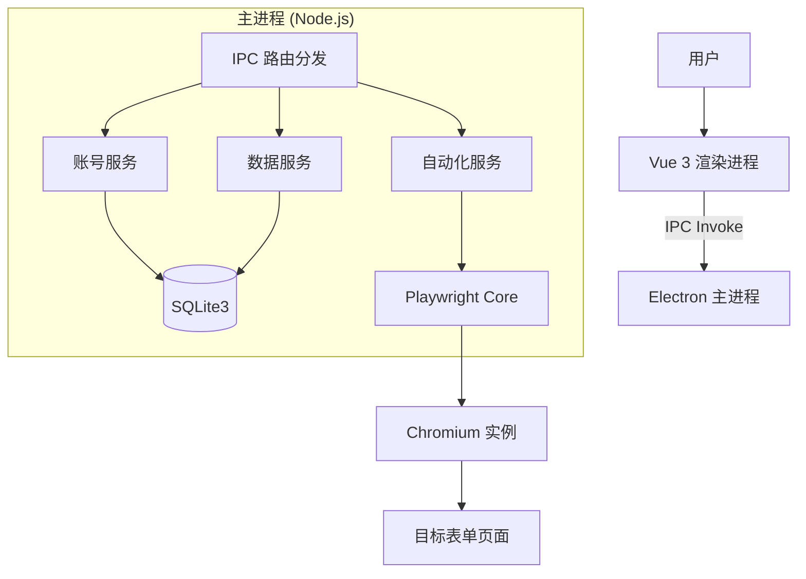

# 多账号表单自动填写工具 PRD（V2.0.0）

# 一、文档基础信息

| 项目名称 | 多账号表单自动填写工具 (AutoFill Forms) |
| :--- | :--- |
| **PRD版本** | **V2.0.0** (Electron 重构版) |
| **产品负责人** | 技术团队 |
| **核心目标** | 基于 Electron 桌面应用架构，实现多账号数据的本地安全存储与自动化表单填写，彻底解决浏览器沙箱限制，提供稳定高效的自动化体验。 |
| **适用人群** | 新媒体平台运营官、批量表单填写需求用户 |
| **当前状态** | **开发中** (后端迁移与数据库集成阶段) |
| **技术核心** | Electron + Vue 3 + SQLite + Playwright |

# 二、需求分析

## 2.1 业务背景
项目已从纯前端 Web 原型（V1.0）演进为桌面客户端（V2.0）。原有的 Web 版本受限于浏览器安全沙箱，无法直接操作本地文件系统进行高效的数据读写，且跨域的自动化填写受到诸多限制。V2.0 版本通过引入 Electron 框架和 SQLite 嵌入式数据库，旨在构建一个功能完备、性能强大且隐私安全的桌面级应用。

## 2.2 用户痛点与解决方案
| 痛点 | V1.0 (Web) 局限 | V2.0 (Electron) 解决方案 |
| :--- | :--- | :--- |
| **数据安全** | 依赖 LocalStorage，容易丢失，迁移困难 | **SQLite 本地数据库**：数据持久化存储，支持百万级数据量，文件级备份。 |
| **自动化能力** | 仅能通过 iframe/脚本模拟，受跨域限制严重 | **Playwright 引擎**：基于系统级浏览器控制，支持无头/有头模式，模拟真实用户行为，绕过检测。 |
| **文件操作** | 无法直接读写本地 Excel/CSV | **Node.js 文件系统**：直接读写本地文件，支持批量导入导出，性能极高。 |
| **部署安装** | 需搭建 Web 服务器或本地服务 | **一键安装包 (.exe/.dmg)**：标准桌面应用体验，开箱即用。 |

## 2.3 需求边界 (V2.0)

### 2.3.1 核心纳入范围
- **桌面客户端架构**：Windows/Mac 双平台支持，离线可用。
- **本地数据库管理**：内置 SQLite 数据库，管理账号、表单模板、日志等核心数据。
- **高仿真自动化**：集成 Playwright 浏览器内核，支持复杂的表单交互（下拉、级联选择、滑块验证等）。
- **系统级集成**：支持系统托盘、原生通知、自动更新。

### 2.3.2 暂不纳入范围
- **云端同步**：当前版本专注于本地隐私优先，暂不提供云端账号同步功能。
- **移动端 App**：专注于 PC 桌面端的高效操作。

# 三、功能模块设计

## 3.1 账号管理模块 (Account System)
**底层实现**：`AccountService` + `SQLite (accounts table)`

### 3.1.1 功能描述
提供全字段自定义的账号管理能力，数据完全本地化。

### 3.1.2 核心功能点
- **结构化存储**：除了基础字段（昵称、ID），支持 JSON 格式的扩展字段存储，满足不同平台的特殊属性需求。
- **高性能检索**：利用 SQL 索引实现毫秒级的账号搜索与筛选（按粉丝量、平台、状态）。
- **数据导入导出**：支持直接读取 Excel/CSV 文件批量导入账号，或将数据库内容导出为 Excel 备份。

## 3.2 自动化填表引擎 (Automation Engine)
**底层实现**：`AutoFillService` + `Playwright`

### 3.2.1 功能描述
利用 Playwright 强大的浏览器控制能力，实现“所见即所得”的自动化填写。

### 3.2.2 核心功能点
- **智能元素定位**：结合 XPath、CSS Selector 和文本匹配的混合定位策略，提高表单字段识别的准确率。
- **隐身模式 (Stealth Mode)**：自动隐藏自动化特征（如 `navigator.webdriver`），防止被表单平台反爬虫机制拦截。
- **可视化执行**：支持开启“有头模式 (Headed Mode)”，用户可实时观看填写过程；也支持“无头模式 (Headless)”后台静默执行。
- **异常熔断**：遇到网络超时或元素未找到时，自动截图记录现场，并终止当前任务，防止错误提交。

## 3.3 模板与映射系统 (Template System)
**底层实现**：`FormService` + `SQLite (form_templates table)`

### 3.3.1 功能描述
解耦“表单”与“账号”，通过映射规则实现灵活匹配。

### 3.3.2 核心功能点
- **动态字段映射**：建立表单字段名（如“您的手机号”）与账号属性（如 `phone`）的映射关系，支持正则表达式匹配。
- **模板持久化**：映射规则保存为模板，下次遇到相同或相似表单可直接复用。

## 3.4 数据安全与日志 (Security & Logs)
**底层实现**：`DataService` + `SQLite (logs table)`

### 3.4.1 功能描述
确保每一次操作都有据可查，每一次数据变更都安全可靠。

### 3.4.2 核心功能点
- **操作审计**：记录每一次自动填写的详细日志（时间、账号、结果、耗时）。
- **自动备份**：应用退出时自动备份数据库文件 (`data.db`) 到指定目录，保留最近 7 天的副本。

# 四、页面细节设计 (UI/UX)

## 4.1 整体设计风格
- **框架**：Element Plus (Dark/Light Theme)
- **布局**：响应式侧边栏布局，适配不同分辨率的桌面显示器。

## 4.2 核心交互优化
- **状态同步**：利用 IPC 通信实现渲染进程与主进程的实时状态同步（如填表进度条）。
- **原生体验**：
    - 使用系统原生文件选择对话框。
    - 耗时操作（如导入、备份）显示加载遮罩。
    - 成功/失败操作通过系统通知（Notification）提示，即使应用在后台也能感知。

# 五、技术架构 (Technical Architecture)

## 5.1 架构图

## 5.2 目录规范
- `/electron`: 主进程核心代码 (Backend)
- `/src`: 渲染进程视图代码 (Frontend)
- `/data`: 用户数据存储 (SQLite DB)
- `/dist-electron`: 构建产物

## 5.3 关键技术决策
- **数据库**: 选用 `sqlite3` 原生库，兼顾性能与兼容性。
- **通信**: 严格遵循 `contextBridge` 安全隔离，禁用 `nodeIntegration`。
- **构建**: 使用 `vite-plugin-electron` 实现极速开发热重载 (HMR)。
