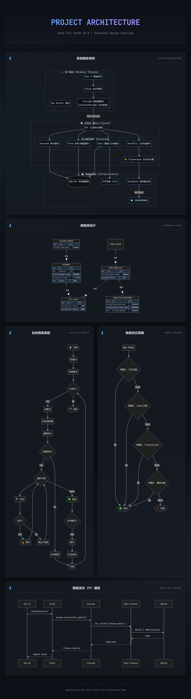

# AutoFill Forms



A powerful desktop application for automated form filling across multiple accounts, built with modern web technologies and automation engines.

## Overview

**AutoFill Forms** is designed to streamline the process of filling out repetitive forms for multiple accounts. It combines a user-friendly interface with a robust automation backend to manage accounts, define form templates, and execute filling tasks automatically.

## Features

- **Multi-Account Management**: Organize and manage multiple user accounts with grouping support.
- **Dynamic Form Templates**: Create flexible form templates with custom field mappings.
- **Automated Execution**: Leverage **Playwright** to simulate real user interactions for accurate and undetectable form filling.
- **Local Data Privacy**: All sensitive data (accounts, logs) is stored locally in a **SQLite** database.
- **System Integration**: Native desktop integration using **Electron**.

## Tech Stack

- **Runtime**: [Electron](https://www.electronjs.org/)
- **Frontend**: [Vue 3](https://vuejs.org/) + [Vite](https://vitejs.dev/)
- **UI Framework**: [Element Plus](https://element-plus.org/)
- **State Management**: [Pinia](https://pinia.vuejs.org/)
- **Backend Logic**: Node.js
- **Database**: [SQLite3](https://github.com/TryGhost/node-sqlite3)
- **Automation Engine**: [Playwright](https://playwright.dev/)

## Getting Started

### Prerequisites

- **Node.js**: Recommended version 18 or higher.
- **Python**: Required for building native modules (like `sqlite3`) on some systems.

### Installation

Clone the repository and install dependencies:

```bash
git clone <repository-url>
cd Project_Auto_Fill_Forms_v3
npm install
```

### Development

Start the application in development mode (starts both Vite dev server and Electron):

```bash
npm run dev
```

### Build

Build the application for production:

```bash
# Build for your current OS
npm run package
```

## Project Structure

```
Project_Auto_Fill_Forms_v3/
├── electron/               # Main Process (Backend)
│   ├── services/           # Business logic services
│   ├── database.js         # SQLite connection
│   └── main.js             # Electron entry point
├── src/                    # Renderer Process (Frontend)
│   ├── components/         # Vue components
│   ├── views/              # Page views
│   └── stores/             # Pinia stores
├── data/                   # Local database storage
└── dist-electron/          # Compiled backend files
```

## License

[MIT](LICENSE)
