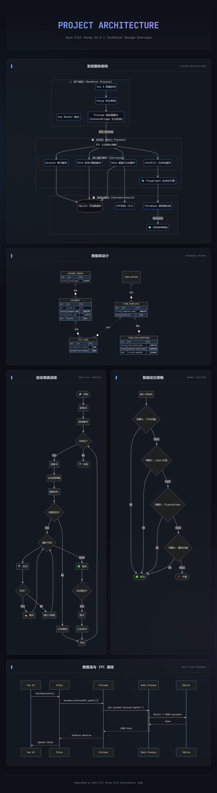

# AutoFill 表单自动填写工具 - 用户使用说明书



## 目录

1. [软件简介](#软件简介)
2. [快速开始](#快速开始)
3. [功能模块详解](#功能模块详解)
4. [常见问题](#常见问题)
5. [注意事项](#注意事项)

---

## 软件简介

AutoFill 是一款基于 Electron 桌面框架开发的多账号表单自动填写工具，专为需要批量填写表单的用户设计（如新媒体运营、达人商务合作等场景）。

### 主要功能

- **多账号管理**：支持批量导入和管理多个账号，分组管理
- **表单自动填写**：自动匹配表单字段与账号属性，一键批量填写
- **多种表单支持**：支持腾讯文档、问卷星、石墨文档、MikeCRM、WPS 等主流表单平台
- **字段智能匹配**：支持同义词模糊匹配，自动建立映射规则
- **数据本地存储**：所有数据存储在本地 SQLite 数据库，安全可控

### 系统要求

- **操作系统**：Windows 10/11 (64-bit)
- **内存**：建议 4GB 及以上
- **硬盘**：至少 500MB 可用空间
- **浏览器**：需要安装 Google Chrome（用于自动化填写）

---

## 快速开始

### 1. 安装应用

1. 下载安装包 `AutoFill Setup x.x.x.exe`
2. 双击运行安装包
3. 选择安装目录（建议使用默认目录）
4. 完成安装后，双击桌面快捷方式启动应用

### 2. 注册/登录

首次使用时需要注册账号：

1. 启动应用后，点击"注册"按钮
2. 填写用户名、密码、确认密码
3. 可选：填写邮箱和手机号（用于找回密码）
4. 点击"注册"完成

已有账号直接登录即可。

### 3. 添加账号

1. 点击左侧菜单"账号管理"
2. 点击"新增账号"或"批量导入"
3. **单个添加**：填写账号信息（昵称、ID、类型等）
4. **批量导入**：支持 Excel (.xlsx) 和 CSV 格式

### 4. 创建表单模板

1. 点击左侧菜单"表单列表"
2. 创建文件夹整理不同类型的表单
3. 点击"新增模板"，填写：
   - 模板名称（便于识别）
   - 表单URL（粘贴表单网址）
   - 表单类型（选择对应的平台）
4. 保存模板

### 5. 配置字段映射

在"表单填写"页面或"全局映射"页面配置字段对应关系：

1. 选择要配置的表单模板
2. 添加映射规则，例如：
   - 表单字段"博主姓名" → 账号属性"blogger_name"
   - 表单字段"粉丝数量" → 账号属性"fans_count"
3. 保存映射规则

### 6. 开始自动填写

1. 进入"表单填写"页面
2. 左侧选择要使用的账号（可多选）
3. 中间选择表单模板
4. 右侧预览表单，确认无误后点击：
   - **自动填写**：仅填表，不提交
   - **提交并切换下一份**：填表并自动提交，然后切换到下一个账号

---

## 功能模块详解

### 账号管理

#### 添加账号

支持以下字段：

| 字段 | 说明 |
|------|------|
| 博主姓名 | 真实姓名 |
| 账号昵称 | 平台显示名称 |
| 账号类型 | 如：小红书、抖音、B站等 |
| 账号ID | 平台唯一标识 |
| 主页链接 | 个人主页URL |
| 粉丝数量 | 粉丝数 |
| 平均阅读量 | 内容平均阅读数 |
| 点赞量 | 平均点赞数 |
| 评论量 | 平均评论数 |
| 单条报价 | 图文合作单价 |
| 套餐报价 | 打包合作价格 |
| 合作形式 | 图文/视频/图文+视频 |
| 联系方式 | 手机/微信/邮箱等 |
| 扩展字段 | 支持自定义JSON字段 |

#### 批量导入

1. 准备 Excel 文件，第一行为字段名
2. 点击"批量导入"按钮
3. 选择文件，等待导入完成

**Excel 格式示例：**

| blogger_name | account_nickname | account_type | fans_count |
|--------------|-----------------|--------------|------------|
| 张三 | 时尚小达人 | 小红书 | 50000 |
| 李四 | 美食探店王 | 抖音 | 120000 |

### 表单模板

支持的表单类型：

| 类型 | 说明 |
|------|------|
| 腾讯文档 | 腾讯文档在线表单 |
| 问卷星 | 问卷星平台表单 |
| 石墨文档 | 石墨文档表单 |
| MikeCRM | MikeCRM 表单 |
| WPS | WPS 表单 |
| 小程序 | 微信小程序表单 |

### 字段映射规则

#### 本地映射

针对单个表单模板配置字段映射：
1. 进入"表单填写"页面
2. 选择模板后，点击"编辑映射"
3. 配置每个表单字段对应的账号属性

#### 全局映射

设置全局通用的映射规则，所有表单模板共享：
1. 进入"全局映射"页面
2. 添加映射关键词和对应账号字段
3. 系统自动匹配包含该关键词的表单字段

**匹配示例：**

| 关键词 | 对应账号字段 |
|--------|-------------|
| 姓名 | blogger_name |
| 昵称 | account_nickname |
| 粉丝 | fans_count |
| 报价 | quote_single |

### 自动化填写

#### 填写流程

1. 选择目标表单URL
2. 系统自动扫描页面表单字段
3. 根据映射规则自动填入账号数据
4. 支持自动提交或手动提交

#### 设置选项

| 选项 | 说明 |
|------|------|
| 提交间隔 | 多个账号之间的提交间隔时间（秒） |
| 自动提交 | 是否自动点击提交按钮 |
| 显示浏览器 | 是否显示浏览器窗口 |

### 数据管理

#### 填写日志

记录每次填表的详细信息：
- 填写时间
- 使用的账号
- 填写的模板
- 成功/失败状态
- 失败原因（如有）

#### 数据备份

支持手动备份和自动备份：
- 备份所有账号、模板、映射规则
- 可从备份文件恢复数据

### 系统设置

#### 主题设置

- 浅色模式：适合白天使用
- 深色模式：适合夜间使用，保护眼睛

#### 语言设置

- 简体中文
- English（英文界面）

---

## 常见问题

### Q1: 安装时报"无法安装"错误

**可能原因：**
- 杀毒软件拦截
- 上一个版本未完全卸载

**解决方案：**
1. 关闭杀毒软件
2. 完全卸载旧版本后重试

### Q2: 自动填写时字段匹配不准确

**可能原因：**
- 表单字段名称与映射规则不匹配
- 表单使用了特殊结构

**解决方案：**
1. 进入"全局映射"添加更多匹配关键词
2. 或在表单填写页面手动编辑映射

### Q3: 批量导入失败

**可能原因：**
- Excel 格式不正确
- 字段名不匹配

**解决方案：**
1. 确保第一行是字段名
2. 参考"批量导入"章节的格式要求

### Q4: 浏览器窗口无法显示

**可能原因：**
- 未安装 Google Chrome
- Chrome 路径配置错误

**解决方案：**
1. 安装最新版本的 Google Chrome
2. 确保 Chrome 安装在默认路径

### Q5: 数据丢失怎么办

**解决方案：**
1. 定期使用"数据备份"功能
2. 从备份文件恢复数据

---

## 注意事项

### 安全使用

1. **保护账号信息**：不要在公共场合透露账号密码
2. **定期备份**：重要数据定期备份
3. **来源可靠**：只从官方渠道下载安装包

### 使用建议

1. **先测试再批量**：首次使用建议先测试1-2个账号，确认无误后再批量操作
2. **设置合理间隔**：批量填写时建议设置2-3秒间隔，避免被平台限流
3. **及时更新映射**：表单结构变化后及时更新映射规则

### 技术限制

1. 部分使用复杂验证码的表单可能无法自动填写
2. 部分防护较强的网站可能需要额外配置
3. 本工具仅供合法合规用途使用

---

## 快捷键

| 快捷键 | 功能 |
|--------|------|
| Ctrl + Q | 退出应用 |
| Ctrl + , | 打开设置 |

---

## 技术支持

如遇到问题，请通过以下方式联系：

- 提交反馈：在应用内"帮助与反馈"页面提交问题描述
- 邮箱：support@autofill.example.com

---

## 版本信息

当前版本：1.0.0

---

## 开发者说明

### 环境要求

- Node.js >= 18
- npm >= 8
- Windows 10/11 (64-bit)
- Google Chrome（用于自动化填写）

### 安装依赖

```bash
npm install
```

### 开发模式

```bash
npm run dev
```

### 打包应用

```bash
# 打包成安装包
npm run package

# 打包成目录（不生成安装包）
npm run package:dir
```

打包后的文件位于 `release/` 目录。

### 注意事项

1. **首次打包需要下载 Playwright 浏览器**，时间可能较长
2. 打包前请确保已安装 `electron-builder`
3. Windows 平台会生成 `.exe` 安装包

### 目录结构说明

```
auto_fill_form/
├── electron/           # Electron 主进程代码
│   ├── main.js        # 应用入口
│   ├── preload.js     # 预加载脚本
│   ├── database.js    # 数据库模块
│   └── services/      # 业务服务层
├── src/               # Vue 前端代码
│   ├── views/        # 页面组件
│   ├── stores/       # 状态管理
│   ├── router/       # 路由配置
│   └── locales/      # 国际化语言包
├── dist/              # Vue 构建产物
├── dist-electron/      # Electron 构建产物
├── release/           # 打包输出目录
└── data/             # 数据库文件（运行时生成）
```

---

*最后更新：2024年*
